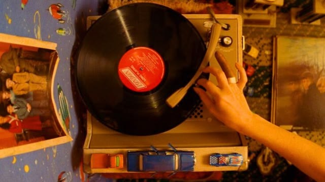

<div align="center">


<br>

██╗███████╗ █████╗ ██████╗  ██████╗ ██████╗  █████╗
██║██╔════╝██╔══██╗██╔══██╗██╔═══██╗██╔══██╗██╔══██╗
██║███████╗███████║██║  ██║██║   ██║██████╔╝███████║
██║╚════██║██╔══██║██║  ██║██║   ██║██╔══██╗██╔══██║
██║███████║██║  ██║██████╔╝╚██████╔╝██║  ██║██║  ██║
╚═╝╚══════╝╚═╝  ╚═╝╚═════╝  ╚═════╝ ╚═╝  ╚═╝╚═╝  ╚═╝


▄▀▄▀▄▀▄▀▄▀▄▀▄▀▄▀▄▀▄▀▄▀▄▀▄▀▄▀▄▀▄▀▄▀▄▀▄▀▄▀▄▀▄▀▄▀▄▀▄▀

</div>

## 📼 Sobre mim

```
> WHOAMI.EXE
> Nome ......... Isadora
> Curso ........ Análise e Desenvolvimento de Sistemas
> Status ....... [ ONLINE ] compilando o futuro, um commit de cada vez
> Hobbies ....... vinil, nostalgia analógica e código novo
```

Oi! Eu sou a **Isadora** 👩‍💻, estudante de **Análise e Desenvolvimento de Sistemas**.
Curto misturar a estética *old school* com tecnologia de verdade — por isso esse perfil parece que foi tirado direto de um CD-ROM dos anos 90.

▄▀▄▀▄▀▄▀▄▀▄▀▄▀▄▀▄▀▄▀▄▀▄▀▄▀▄▀▄▀▄▀▄▀▄▀▄▀▄▀▄▀▄▀▄▀▄▀▄▀

## 🖥️ Tecnologias que eu uso

<div align="center">


</div>

▄▀▄▀▄▀▄▀▄▀▄▀▄▀▄▀▄▀▄▀▄▀▄▀▄▀▄▀▄▀▄▀▄▀▄▀▄▀▄▀▄▀▄▀▄▀▄▀▄▀

## 📸 Um pouco do meu mundo

<div align="center">

<table>
<tr>
<td align="center" width="50%">
<br>
<sub>🐱 fiscal de qualidade oficial das minhas builds</sub>
</td>
<td align="center" width="50%">
<br>
<sub>💿 trilha sonora pra debugar: sempre em vinil</sub>
</td>
</tr>
</table>

</div>

▄▀▄▀▄▀▄▀▄▀▄▀▄▀▄▀▄▀▄▀▄▀▄▀▄▀▄▀▄▀▄▀▄▀▄▀▄▀▄▀▄▀▄▀▄▀▄▀▄▀

<p align="center">✦ ────────────── ✦ ────────────── ✦</p>

<h2 align="center">CONTRIBUIÇÕES</h2>

<p align="center">

</p>

> Pra essa animação funcionar no seu perfil, é só seguir 3 passos rápidos:
> 1. Troque `SEU-USUARIO` acima pelo seu usuário do GitHub (duas vezes no link).
> 2. Crie o arquivo `.github/workflows/snake.yml` no seu repositório `SEU-USUARIO/SEU-USUARIO` com a action [`Platane/snk`](https://github.com/Platane/snk).
> 3. Rode a action uma vez (ou espere o agendamento) — ela gera o SVG automaticamente e o gif aparece aqui.

▄▀▄▀▄▀▄▀▄▀▄▀▄▀▄▀▄▀▄▀▄▀▄▀▄▀▄▀▄▀▄▀▄▀▄▀▄▀▄▀▄▀▄▀▄▀▄▀▄▀

<div align="center">


<sub>feito com 💾 e nostalgia • volte sempre</sub>

</div>
